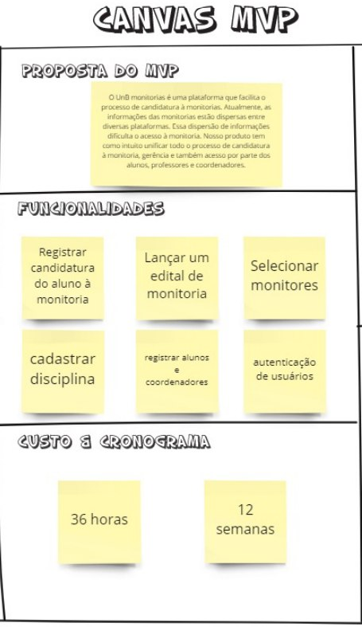
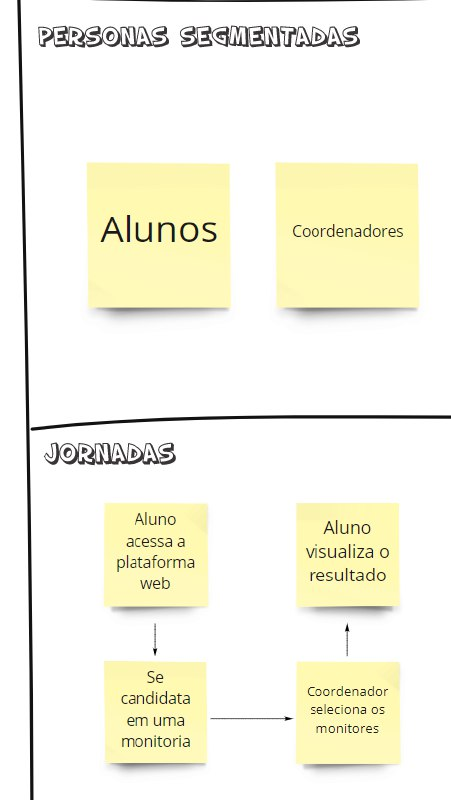
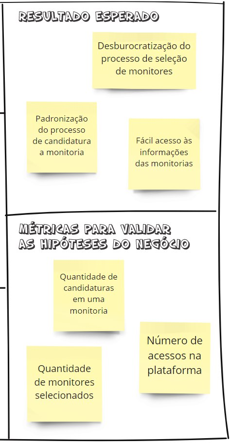

# Documento de Visão do Projeto -  UnB Monitorias

## Histórico de Revisão
| Data   | Versão | Modificação  | Autor  |
| :-- | :-- | :-- | :-- |
| 04/08/2021 | 0.1 | Estrutura do documento de visão|  Flávio Vieira |
| 04/08/2021 | 0.2 | Preenchimento do documento de visão |  Todos |
| 05/08/2021 | 0.3 | Ajuste de formatação no documento | Carla Cangussú |
| 05/08/2021 | 0.4 | Revisão do tópico gerenciamento de riscos e ajuste de formatação | Flávio Vieira |

## Sumário
    1. INTRODUÇÃO    
        1.1.	Problema 
        1.2.	Declaração do Problema  
        1.3.	Objetivos do Projeto
    2. STAKEHOLDERS  
    3. VISÃO GERAL DO PRODUTO  
        3.1.	Declaração de Posição do Produto  
        3.2.	Mínimo Produto Viável (MVP)
    4. VISÃO GERAL DO PROJETO  
        4.1.	Organização do Projeto  
    5. FERRAMENTAS, AMBIENTE E INFRA-ESTRUTURA  
        5.1.	Hardware  
        5.2.	Software
    6. PROCESSO DE GERÊNCIA DE PROJETO  
        6.1.	Planejamento das Fases e Iterações do Projeto  
        6.2.	Processo de Desenvolvimento e Mensuração  
        6.3.	Matriz de Comunicação  
        6.4.	Escalabilidade do Projeto  
        6.5.	Gerenciamento de Riscos  
    7. LIÇÕES APRENDIDAS
    8. REFERÊNCIAS
    9. CANVAS MVP

## Visão do Projeto
### **1. Introdução**  
#### 1.1. Declaração do Problema
| Questionamento | Resposta |
| :------------- | :------- |
| O problema  | Falta de um sistema para gestão de monitoria |
| Afeta | Os alunos, monitores, professores e coordenadores de graduação |
| Cujo impacto é | Informações dispersas, burocratização no processo de candidatura à monitoria, redução do número de candidatos |
| Uma solução de sucesso seria | Centralizar as informações e etapas do processo em uma só plataforma mais transparente|  

#### 1.2. Objetivos do Projeto
* Unificar todo o processo de candidatura à monitoria, gerência e também acesso por parte dos alunos, professores e coordenadores. 
* Facilitar o acesso às informações do perfil e da disponibilidade dos monitores
* Acesso rápido às informações sobre as monitorias selecionadas pelo aluno

### **2. Stakeholders**
| Nome | Descrição | Responsabilidade |
| :--- | :-------- | :--------------- |  
| Equipe de desenvolvimento | Planejamento, desenvolvimento e manutenção da plataforma de acordo com as premissas e regras de negócio dos investidores |Executar o projeto dentro do prazo estipulado com base no escopo de engenharia de requisitos previamente definido|
| Aluno | Graduando da UnB |Selecionar as monitoria de sua preferência para receber as informações. Se candidatar a monitor se desejar |
| Monitor | Aluno aceito no processo de candidatura a monitoria |Cadastra as informações referentes as monitorias que ministra|
| Professor | Ministra uma disciplina | Solicitar monitores para sua disciplina e avaliá-los |
| Coordenador | Pessoa responsável pelo processo de candidatura a monitoria | Avaliar e selecionar os alunos que serão monitores |

### **3. Visão Geral do Produto**  
#### 3.1. Declaração de Posição do Produto
| Posição do produto | Descrição |
|:-------------------|:----------|
| Para | alunos, monitores, professores e coordenadores de graduação da UnB|
| Quem | deseja gerenciar as suas monitorias do semestre |
| O *UnB Monitorias* | deseja gerenciar as suas monitorias do semestre |
| Que | facilita o acesso às informações de todas as monitorias e do processo de candidatura à monitoria, pois podem ser acessadas a todo momento e em qualquer lugar por meio de um celular |
| Ao contrário | das informações dispersas sobre a monitoria e do seu processo de candidatura |
| Nosso produto | unifica todo o processo de candidatura à monitoria, gerência e também acesso por parte dos alunos, professores e coordenadores. |

#### 3.2. Escopo do Produto
#### 3.2.1 Requisitos Funcionais
| Identificador | Descrição alto nível | 
| :------------ | :-------- |
| RF01 | Permitir ao Aluno crie, edite, faça login e apague sua conta |
| RF02 | Permitir ao Aluno se candidatar a uma vaga de monitoria em uma disciplina |
| RF03 | Permitir ao Aluno seguir uma monitoria de uma disciplina |
| RF04 | Permitir ao Aluno consultar local, horário e agendar atendimento com um monitor |
| RF05 | Permitir ao Aluno avaliar os monitores |
| RF06 | Permitir ao Aluno/Monitor cadastrar horário e local de sua monitoria |
| RF07 | Permitir ao Aluno/Monitor Registrar as atividades/ atendimentos realizados |
| RF08 | Permitir ao professor crie, edite, faça login e apague sua conta |
| RF09 | Permitir ao Professor e Coordenador possa cadastrar, atualizar e excluir disciplinas de um curso |
| RF10 | Permitir ao Professor lançar um plano de monitoria para sua turma de uma disciplina |
| RF11 | Permitir ao Professor selecionar os monitores classificados para sua disciplina|
| RF12 | Permitir ao Professor gerenciar as atividades realizadas pelos monitores |
| RF13 | Permitir ao Professor avaliar seus monitores |
| RF14 | Permitir ao Coordenador gerenciar os cursos | 
| RF15 | Permitir ao Coordenador aprovar e editar o plano de monitoria dos professores |
| RF16 | Permitir ao Coordenador criar, editar e lançar edital com vagas de monitorias | 
| RF17 | Permitir ao Coordenador homologar os candidatos a monitoria selecionados pelos professores |
| RF18 | Permitir ao Coordenador acessar relatórios e gerenciar monitores classificados |
| RF19 | Permitir que um professor possa ser classificado como coordenador de um curso |
| RF20 | Exibir notificações e atualizações nas monitorias seguidas pelo aluno |
| RF21 | Exibir Avisos gerais |
| RF22 | Exibir todas as disciplinas com monitores cadastrados |

#### 3.2.2 Requisitos não Funcionais

| Identificador | Requisito |
| :------------ | :-------- |
| RNF01 | Garantir a segurança dos dados do usuário |
| RNF02 | A Plataforma deve suportar os principais navegadores web |
| RNF03 | A plataforma deve seguir as recomendações para acessibilidae na WEB do WCAG |
| RNF04 | A plataforma deve seguir boas práticas de usabilidade |
| RNF05 | O sistema deve controlar o acesso por meio de permiçõoes para cada perfil de usuário |

#### 3.3 Mínimo Produto Viável (MVP)
* Registrar alunos e coordenadores
* Cadastrar disciplina
* Registrar candidatura do aluno à monitoria
* Lançar um edital de monitoria
* Selecionar monitores
* Autenticar usuários

### **4. Visão Geral do Projeto**  
#### 4.1. Organização do Projeto
| Papel | Atribuições | Responsável | Participantes |
|:------|:------------|:------------|:--------------|
| Desenvolvedor | Executar o projeto com base no escopo | Mateus Brandão | Todos |
| Mentor | Avaliar a qualidade do projeto | George Marsicano | George Marsicano |
|Líder (por ciclo) |Direcionar e acompanhar o trabalho do ciclo | Todos | Todos | 

### **5. Ferramentas, Ambiente e Infra-Estrutura**
#### 5.1. Hardware  
| Perfil | Tipo de Hardware | Configurações | Qtd. PLanejada | Prazo Estimado | Observação |
|:-------|:-----------------|:--------------|:---------------|:---------------|:-----------|
| Desenvolvedor | Computador | Intel I3; 4gb RAM; | 6 | 02/08/2021 | - | 

#### 5.2. Software  
| Perfil | Tipo de Software | Nome da Ferramenta | Versão | Qtd. Licensas | Prazo Estimado | Observação |
|:-------|:-----------------|:-------------------|:-------|:--------------|:---------------|:-----------|
| Desenvolvedor | Editor de Código | VSCode/Pycharm | | Free | 06/08/2021 | - | 
| Desenvolvedor | Gerenciador de Versionamento | Git Hub | | Free | 06/08/2021 | - |
| Desenvolvedor | Comunicação | Microsoft Teams / Telegram | | Free | 06/08/2021 | - |
| Desenvolvedor | Deploy | Vercel | | Free | 06/08/2021 | - |
| Desenvolvedor | Browser | Google Chrome | | Free | 06/08/2021 | - |

### **6. Processo de Gerência de Projeto**  
#### 6.1. Processo de Desenvolvimento e Mensuração  
Para acompanhamento do progresso do projeto será utilizado o quadro kanban. A mensuração será feita pela quantidade de entregas feitas.

#### 6.2. Planejamento das Fases e Iterações do Projeto
| inicio | fim |  iteração e fase | entrega| 
| :------| :-- | :----------------| :------|
| 05/08/2021 | 18/08/2021 | 1 - Requisitos e design | Ajuste de escopo, levantamento de requisitos e definição do design ||
| 19/08/2021 | 01/09/2021 | 2 - Construção  e teste| Registro de alunos e coordenadores  e Autenticação de usuários  |
| 02/09/2021 | 15/09/2021 | 3 - Construção e teste | Cadastro disciplina e Lançar um edital de monitoria |
| 16/09/2021 | 29/09/2021 | 4 - Construção e teste | Registro da candidatura do aluno à monitoria e Seleção dos monitores | 
| 30/09/2021 | 07/10/2021 | 5 - Teste |Teste finais e últimos ajustes |

#### 6.3. Matriz de Comunicação 
| Descrição | Área/Envolvidos | Periodicidade | Produtos Gerados |
| :-------- | :-------------- | :------------ | :--------------- |
| Acompanhamento das Atividades em Andamento | Equipe | Semanal | Ata de reunião e Relatório de situação do projeto |
| Acompanhamento dos Riscos, Compromissos, Ações Pendentes, Indicadores | Equipe | Quinzenal | Ata de reunião e Relatório de situação do projeto |
| Comunicar situação do projeto com o professor | Equipe e Mentor | Quinzenal | Ata de reunião e Relatório de Situação do Projeto |

#### 6.4. Escalabilidade do Projeto
| Conflito | Descrição | Responsável | solução |
| :------- | :-------- | :---------- | :------ |
| C01 | Planejamento Ineficiente | Líder ciclo 1 | Levantar os pontos falhos o mais rápido possível e corrigir nas próximas iterações |
| C02 | Mudança de escopo | Líder do ciclo vigente | Entender melhor as necessidades e expectivas dos usuários para fazer alterações assertivas no escopo, evitando novas |
| C03 | Problema de comunicação entre os membros da equipe | Todos | Usar o todos os canais possíveis | 
| C04 | Concentração do conhecimento em poucos membros da equipe | Todos |Identificar membros mais experientes e fazer pareamentos para transferência de conhecimentos |
| C05 | Desistência de Membros | Líder do ciclo vigente | Realocar tarefas entre os membros da equipe |
| C06 | Limitação com as tecnologias | Todos | Realizar treinamentos e pareamentos com membros mais experientes | 

#### 6.5. Gerenciamento de Riscos

##### 6.5.1 Análise quantitativa dos riscos e Impacto  

| Peso | Impacto | Probabilidade | 
| :---- | :------ | :------------ | 
| 1 | Muito Baixo | Menor que 20% |
| 2 | Baixo | de 21% a 40% |
| 3 | Médio | de 41% a 60% |
| 4 | Alto | de 61% a 80% |
| 5 | Muito Alto | acima de 80% |

A avaliação é feita multiplicando o peso da probabilidade pelo peso do impacto
| Probabilidade / Impacto | Muito baixo | Baixo | Médio | Alto | Muito Alto|
| :------------- |:----------: | :----: | :----: | :---: | :--------: |
| Muito baixo | 1 | 2 | 3 | 4 | 5 |
| Baixo | 2 | 4 | 6 | 8 | 10 |
| Médio | 3 | 6 | 9 | 12| 15|
| Alto | 4 | 8 | 12 | 16 | 20|
| Muito Alto| 5 | 10 | 15 | 20 | 25 |

Com base na avaliação elaborada é possível definir o risco e as prioridades de ação. 
| Risco | Intervalo | Descrição | Ação |
| :---- | :--------: | :------- | :--- | 
| Pequeno  | 1  -  6 | Riscos aceitáveis | monitorar com baixa frequência |
| Moderado | 7  - 13 | Riscos cotidianos | monitorar com frequentemente |
| Alto     | 14 - 19 | Riscos altos se não tratados podem se tornar críticos | Ter um plano de contingência para reduzir o impacto | |
| Crítico  | 20 - 25 | Riscos quem podem inviabilizar o projeto | Ações de mitigação devem ter prioridade para reduzir a probabilidade |

##### 6.5.1 Levantamento de riscos  

| Id | Descrição | Probabilidade | Impacto | Avaliação| Mitigação / Contingência |
| :---- | :-------- | :------------ | :------ | :------ | :---------|
| R01 | Planejamento Ineficiente | Alta | Muito alto | 20 | Levantar os pontos falhos o mais rápido possível e corrigir nas próximas iterações |
| R02 | Mudança de escopo | Baixa | Muito Alto | 10 |Entender melhor as necessidades e expectativas dos usuários para fazer alterações assertivas no escopo, evitando novas |
| R03 | Problemas de comunicação entre os membros da equipe | Média | Baixo | 6 | Usar o todos os canais possíveis |  
| R04 | Concentração do conhecimento em poucos membros da equipe | Baixa | Médio | 6 |Identificar membros mais experientes e fazer pareamentos para transferência de conhecimentos |
| R05 | Desistência ou ausência de um membro da equipe | Alto | Muito alto | 20 | Motivar a equipe para importância do projeto / Realocar tarefas entre os membros da equipe |
| R06 | Limitação dos desenvolvedores com as tecnologias | Alta | Alta | 16 |Realizar treinamentos e pareamentos com membros mais experientes | 
| R07 | Mudança na arquitetura do Projeto | Média | Muito alta | 15 |Análise detalhada as tecnologias definidas de modo a garantir a viabilidade do Projeto / Definir no arquitetura, replanejamento do cronograma e necessidade treinamentos na nova tecnologia|

#### 6.6. Critérios de Replanejamento  
* Prazo: o tempo que temos para realocar a entrega
* Equipe: Quantas pessoas tem disponibilidade para poder distribuir as atividades que faltam ser feitas ou devem ser refeitas
* Competência: qual é a pessoa mais indica para a determinada tarefa

### **7. Lições Aprendidas**
* Utilização do Kanban como uma metodologia de desenvolvimento
* Especificação de requisitos
* Fazer um MVP
* Estrutura básica da visão do produto
* Análise e gerenciamento de riscos

### **8. Referências** 
1. DEG-Monitoria <http://www.deg.unb.br/monitoria> acessado em: 03/08/2021 às 23:20
2. Caroli Org <https://www.caroli.org/o-canvas-mvp/> acessado em: 04/08/2021 às 22:40 
3. Miro <https://miro.com/app/board/o9J_l3wrIY8=/> acessado em: 04/08/2021 às 22:20
4. HILLSON, D. The risk breakdown structure (RBS) as an aid to effective risk management. 
   Fifth European Project Management Conference. Cannes. 2002 PRESSMAN, Roger S. – 
   “ Engenharia de Software ” - Makron Books do Brasil Editora Ltda

### **9. Canvas MVP** 

  

  

  

