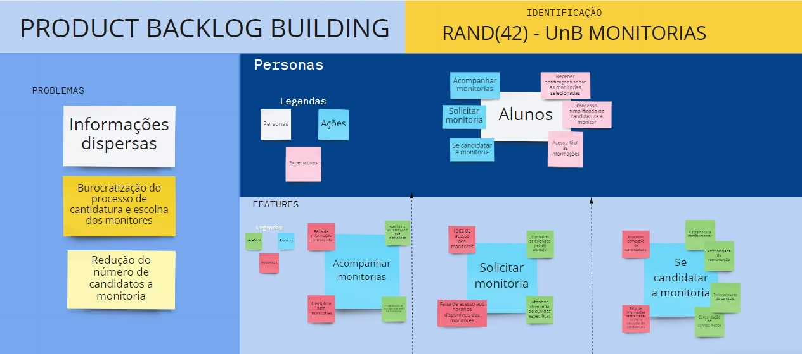
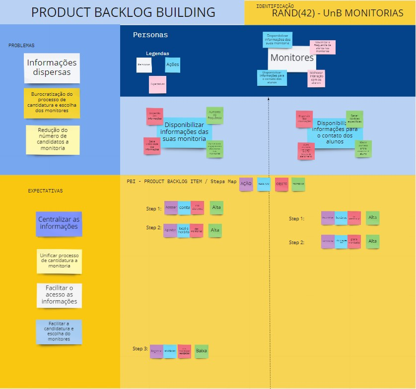

# Documento de Visão do Projeto -  UnB Monitorias

## Histórico de Revisão
| Data       | Versão | Modificação                                                                   | Autor                                           |
| :--------- | :----- | :---------------------------------------------------------------------------- | :---------------------------------------------- |
| 04/08/2021 | 0.1    | Estrutura do documento de visão                                               | Flávio Vieira                                   |
| 04/08/2021 | 0.2    | Preenchimento do documento de visão                                           | Todos                                           |
| 05/08/2021 | 0.3    | Ajuste de formatação no documento                                             | Carla Cangussú                                  |
| 05/08/2021 | 0.4    | Revisão do tópico gerenciamento de riscos e ajuste de formatação              | Flávio Vieira                                   |
| 16/08/2021 | 0.5    | Atualizar lista de requisitos e adicionar o tipo, atributos e características | Todos                                           |
| 23/08/2021 | 0.6    | Correção dos pontos indicados no feedback do monitor                          | Carla Cangussú                                  |
| 26/08/2021 | 0.7    | Inclusão do backlog do produto                                                | Todos                                           |
| 27/08/2021 | 0.8    | Correção de erros ortográficos e ajuste no texto                              | Iago Oliveira                                   |
| 15/09/2021 | 0.9    | Elaboração do PBB                                                             | Carla, Henrique, Mateus e Iago Oliveira         |
| 16/09/2021 | 1.0    | Elaboração do BDD                                                             | Iago de Andrade                                 |
| 16/09/2021 | 1.1    | Acrescentar PBB e BDD no documento de visão e fazer os ajustes necessários    | Carla Cangussú e Iago Oliveira                  |
| 03/10/2021 | 1.2    | Atualização dos requisitos e manutenção da rastreabilidade do projeto         | Carla Cangussú, Iago Oliveira e Iago de Andrade |

## Sumário
    1. INTRODUÇÃO    
        1.1.	Problema 
        1.2.	Declaração do Problema  
        1.3.	Objetivos do Projeto
    2. STAKEHOLDERS  
    3. VISÃO GERAL DO PRODUTO  
        3.1.	Declaração de Posição do Produto  
        3.2.	Escopo do Projeto
            3.2.1 Requisitos Funcionais
            3.2.2 Requisitos Não Funcionais
            3.2.3 Legendas
        3.3.    Mínimo Produto Viável (MVP)
        3.4.     Backlog do Produto
            3.4.1.    Tema estratégico
            3.4.2.    Épicos
            3.4.3.    Features
            3.4.4.    Histórias de usuário
    4. VISÃO GERAL DO PROJETO  
        4.1.	Organização do Projeto  
    5. FERRAMENTAS, AMBIENTE E INFRA-ESTRUTURA  
        5.1.	Hardware  
        5.2.	Software
    6. PROCESSO DE GERÊNCIA DE PROJETO  
        6.1.	Planejamento das Fases e Iterações do Projeto  
        6.2.	Processo de Desenvolvimento e Mensuração  
        6.3.	Matriz de Comunicação  
        6.4.	Escalabilidade do Projeto  
        6.5.	Gerenciamento de Riscos  
    7. LIÇÕES APRENDIDAS
    8. REFERÊNCIAS
    9. CANVAS MVP
    10. PRODUCT BACKLOG BUILDING
    11. BEHAVIOR DRIVEN DEVELOPMENT

## Visão do Projeto
### **1. Introdução**  
#### 1.1. Declaração do Problema
| Questionamento               | Resposta                                                                                                      |
| :--------------------------- | :------------------------------------------------------------------------------------------------------------ |
| O problema                   | Falta de um sistema para gestão de monitoria                                                                  |
| Afeta                        | Os alunos, monitores, professores e coordenadores de graduação                                                |
| Cujo impacto é               | Informações dispersas, burocratização no processo de candidatura à monitoria, redução do número de candidatos |
| Uma solução de sucesso seria | Centralizar as informações e etapas do processo em uma só plataforma mais transparente                        |

#### 1.2. Objetivos do Projeto
* Unificar todo o processo de candidatura à monitoria, gerência e também acesso por parte dos alunos, professores e coordenadores. 
* Facilitar o acesso às informações do perfil e da disponibilidade dos monitores
* Acesso rápido às informações sobre as monitorias selecionadas pelo aluno

### **2. Stakeholders**
| Nome                      | Descrição                                                                                                                | Responsabilidade                                                                                                  |
| :------------------------ | :----------------------------------------------------------------------------------------------------------------------- | :---------------------------------------------------------------------------------------------------------------- |
| Equipe de desenvolvimento | Planejamento, desenvolvimento e manutenção da plataforma de acordo com as premissas e regras de negócio dos investidores | Executar o projeto dentro do prazo estipulado com base no escopo de engenharia de requisitos previamente definido |
| Aluno                     | Graduando da UnB                                                                                                         | Selecionar as monitoria de sua preferência para receber as informações. Se candidatar a monitor se desejar        |
| Monitor                   | Aluno aceito no processo de candidatura a monitoria                                                                      | Cadastra as informações referentes as monitorias que ministra                                                     |
| Professor                 | Ministra uma disciplina                                                                                                  | Solicitar monitores para sua disciplina e avaliá-los                                                              |
| Coordenador               | Pessoa responsável pelo processo de candidatura a monitoria                                                              | Avaliar e selecionar os alunos que serão monitores                                                                |

### **3. Visão Geral do Produto**  
#### 3.1. Declaração de Posição do Produto
| Posição do produto | Descrição                                                                                                                                                                |
| :----------------- | :----------------------------------------------------------------------------------------------------------------------------------------------------------------------- |
| Para               | alunos, monitores, professores e coordenadores de graduação da UnB                                                                                                       |
| Quem               | deseja acompanhar as suas monitorias do semestre                                                                                                                         |
| O *UnB Monitorias* | é uma plataforma web                                                                                                                                                     |
| Que                | facilita o acesso às informações de todas as monitorias e do processo de candidatura à monitoria                                                                         |
| Ao contrário       | das informações dispersas sobre a monitoria e do seu processo de candidatura                                                                                             |
| Nosso produto      | unifica todo o processo de candidatura à monitoria, gerência(planejamento e controle das monitorias)  e também acesso por parte dos alunos, professores e coordenadores. |

#### 3.2. Escopo do Produto
O levantamento de requisitos foi realizado por meio do Brainstorming pela a equipe de desenvolvimento.

#### 3.2.1 Requisitos Funcionais
| Identificador | Descrição                                                                           | Prioridade | Complexidade |
| :------------ | :---------------------------------------------------------------------------------- | :--------: | :----------: |
| RF01          | Cadastrar coordenador                                                               |    alta    |    média     |
| RF02          | Cadastrar aluno                                                                     |    alta    |    média     |
| RF03          | Cadastrar professor                                                                 |    alta    |    média     |
| RF04          | Editar conta do coordenador                                                         |   baixa    |     alta     |
| RF05          | Editar conta do aluno                                                               |   baixa    |     alta     |
| RF06          | Editar conta do professor                                                           |   baixa    |     alta     |
| RF07          | Permitir ao coordenador cadastrar disciplinas                                       |    alta    |     alta     |
| RF08          | Permitir ao coordenador editar disciplinas                                          |   média    |     alta     |
| RF09          | Autenticar usuários                                                                 |    alta    |     alta     |
| RF10          | Permitir ao professor lançar um plano de monitoria para sua turma de uma disciplina |   média    |    média     |
| RF11          | Permitir ao coordenador validar o plano de monitoria dos professores                |   média    |    média     |
| RF12          | Permitir ao coordenador gerenciar editais de monitorias                             |    alta    |     alta     |
| RF13          | Permitir ao aluno se candidatar a uma vaga de monitor em uma disciplina             |    alta    |    baixa     |
| RF14          | Permitir ao professor selecionar os monitores classificados para sua disciplina     |    alta    |    baixa     |
| RF15          | Permitir ao coordenador validar os candidatos a monitoria                           |    alta    |    baixa     |
| RF16          | Permitir ao monitor cadastrar horário e local de sua monitoria                      |    alta    |    média     |
| RF17          | Permitir ao monitor registrar as monitorias realizadas                              |   baixa    |    média     |
| RF18          | Permitir ao professor acompanhar as atividades realizadas pelos monitores           |   baixa    |    média     |
| RF19          | Permitir ao usuário consultar monitorias                                            |    alta    |    baixa     |
| RF20          | Permitir ao aluno acompanhar monitorias ativas                                      |    alta    |    baixa     |
| RF21          | Permitir ao aluno consultar agenda de monitorias                                    |   média    |    baixa     |
| RF22          | Permitir ao aluno agendar atendimento com um monitor                                |   média    |     alta     |
| RF23          | Permitir ao coordenador gerenciar monitores                                         |    alta    |     alta     |
| RF24          | Permitir ao professor gerenciar monitores                                           |   média    |     alta     |
| RF25          | Exibir todas as disciplinas com monitores cadastrados                               |   média    |    baixa     |
| RF26          | Exibir Avisos gerais                                                                |   baixa    |    média     |
| RF27          | Exibir notificações nas monitorias seguidas pelo aluno                              |   baixa    |    média     |
| RF28          | Permitir ao Aluno avaliar os monitores                                              |   baixa    |    baixa     |
| RF29          | Permitir ao Professor avaliar seus monitores                                        |   baixa    |    baixa     |

#### 3.2.2 Requisitos não Funcionais

| Identificador | Descrição Requisito                                                                                    | Prioridade | Tipo do Requisito |
| :------------ | :----------------------------------------------------------------------------------------------------- | :--------: | :---------------: |
| RNF01         | Garantir a segurança dos dados do usuário alinhada com LGPD - Lei Geral de Proteção de Dados do Brasil |    alta    |  confiabilidade   |
| RNF02         | A Plataforma deve suportar os principais navegadores web                                               |    alta    |    usabilidade    |
| RNF03         | A plataforma deve seguir as recomendações para acessibilidade na WEB do WCAG                           |    alta    |    usabilidade    |
| RNF04         | A plataforma deve seguir boas práticas de usabilidade                                                  |    alta    |    usabilidade    |
| RNF05         | O sistema deve controlar o acesso através de permissões para cada perfil de usuário                    |    alta    |   implementação   |

#### 3.2.3 Legendas
| Nível de prioridade |                                                  Descrição                                                  |
| :------------------ | :---------------------------------------------------------------------------------------------------------: |
| Baixa               |                 Requisitos que não causam grande impacto para a qualidade final do projeto                  |
| Média               |                Requisitos complementares para o funcionamento das principais funcionalidades                |
| Alta                | Requisitos cruciais que formam a base do projeto, em que outros requisitos dependem direta ou indiretamente |

| Nível de complexidade |                                         Descrição                                         |
| :-------------------- | :---------------------------------------------------------------------------------------: |
| Baixa                 |           Requisitos de fácil implementação, não demandam muito tempo e esforço           |
| Média                 | Requisitos que apresentam complexidade significativa, demandam em média 1 dia de trabalho |
| Alta                  |          Requisitos que demandam muito tempo e esforço para serem implementados           |

#### 3.3 Mínimo Produto Viável (MVP)
| Identificador |                                Requisito                                |
| :------------ | :---------------------------------------------------------------------: |
| RF01          |                         Cadastrar coordenadores                         |
| RF02          |                            Cadastrar alunos                             |
| RF07          |              Permitir ao coordenador cadastrar disciplinas              |
| RF09          |                           Autenticar usuários                           |
| RF12          |         Permitir ao coordenador gerenciar editais de monitorias         |
| RF13          | Permitir ao aluno se candidatar a uma vaga de monitor em uma disciplina |
| RF15          |        Permitir ao coordenador validar os candidatos a monitoria        |

### 3.4 Backlog do Produto

&nbsp;
### 3.4.1. Tema estratégico
Os objetivos do UnB monitorias que irão direcionar as estratégias do projeto são: unificar todo o processo de candidatura à monitoria, gerenciar as monitorias e autenticar os usuários. O presente projeto tem como diferencial reunir todas as informações das monitorias em uma única plataforma, desde o lançamento do edital de monitoria pelo coordenador até o acompanhamento da monitoria selecionada pelo aluno. Isso torna o acesso às informações rápido e fácil. Além disso, atualmente não encontramos nada parecido, as informações se encontram espalhadas por diversas plataformas, como moodle, sigaa, teams e redes sociais variadas. O que faz esse projeto ser necessário e atrativo.

### 3.4.2. Épicos
| ID   | Descrição                   |
| :--- | :-------------------------- |
| EP1  | Gerenciamento de Usuários   |
| EP2  | Gerenciamento de Monitorias |
| EP3  | Gerenciamento de Monitores  |

### 3.4.3 Features
#### **Épico 01 - Gerenciamento de Usuários**
| ID   | Descrição                        |
| :--- | :------------------------------- |
| F1   | Cadastro de Professores e alunos |
| F2   | Perfil                           |

#### **Épico 02 - Gerenciamento de Monitorias** 
| ID   | Descrição                |
| :--- | :----------------------- |
| F3   | Atendimento Monitoria    |
| F4   | Painel monitorias        |
| F5   | Consultas e Notificações |

#### **Épico 03 - Gerenciamento de Monitores** 
| ID   | Descrição                    |
| :--- | :--------------------------- |
| F6   | Seleção Monitores            |
| F7   | Editais e Plano de Monitoria |
| F8   | Disciplinas                  |
 
### 3.4.4 Histórias de usuário
| Épico | Feature | ID   | Descrição                                                                                                                                                                              |
| :---- | :------ | :--- | :------------------------------------------------------------------------------------------------------------------------------------------------------------------------------------- |
| EP1   | F1      | US01 | Eu, como **aluno**, gostaria de **criar uma conta** para que eu possa **acessar todas as funcionalidades da plataforma**                                                               |
| EP1   | F1      | US02 | Eu, como **professor**, gostaria de **criar uma conta** para que eu possa **acessar todas as funcionalidades da plataforma**                                                           |
| EP1   | F2      | US03 | Eu, como **aluno**, gostaria de **editar meu perfil** para que eu possa **corrigir uma informação errada ou atualizar meu perfil**                                                     |
| EP1   | F2      | US04 | Como **aluno**, gostaria de **excluir minha conta** para que eu possa **apagar meu registro da plataforma**                                                                            |
| EP1   | F2      | US05 | Eu, como **professor**, gostaria de **editar os dados da minha conta** para que eu possa **manter meu atualizado**                                                                     |
| EP2   | F3      | US06 | Eu, como **aluno**, gostaria de **consultar agenda de monitorias** para que eu possa **participar das monitorias**                                                                     |
| EP2   | F3      | US07 | Eu, como **aluno**, gostaria de **solicitar atendimento com um monitor** para que eu possa **ter um atendimento exclusivo com um monitor**                                             |
| EP2   | F4      | US08 | Eu, como **monitor**, gostaria de **cadastrar horário e local da minha monitoria** para que eu possa **que os alunos sejam informados**                                                |
| EP2   | F4      | US09 | Eu, como **monitor**, gostaria de **registrar as monitorias realizadas** para que eu possa **ter maior controle e organização sobre minhas atividades**                                |
| EP2   | F4      | US10 | Eu, como **aluno**, gostaria de **avaliar monitores** para que eu possa **dar meu feedback e ajudar outros alunos e professor sobre atuação do monitor**                               |
| EP1   | F4      | US11 | Eu, como **professor**, gostaria de **ter acesso às informações dos monitores das minhas turmas** para que eu possa **gerenciar suas atividades**                                      |
| EP3   | F4      | US12 | Eu, como **professor**, gostaria de **avaliar monitores** para que eu possa **no final do semestre, aprovar monitores com base nas atividades registradas e feedback dos alunos**      |
| EP2   | F5      | US13 | Eu, como **aluno**, gostaria de **ser notificado quando um novo plano de monitoria/edital for lançado** para que eu possa **me manter informado sobre vagas em monitorias**            |
| EP2   | F5      | US14 | Eu, como **aluno**, gostaria de **seguir monitorias** para que eu possa **receber informações e notificações das atividades na monitoria**                                             |
| EP2   | F5      | US15 | Eu, como **aluno**, gostaria de **editar configurações de notificação** para que eu possa **escolher quais os tipos de notificações desejo receber**                                   |
| EP3   | F6      | US16 | Eu, como **aluno**, gostaria de **candidatar a uma vaga de monitor** para que eu possa **participar do processo de seleção de monitores**                                              |
| EP3   | F6      | US17 | Eu, como **professor**, gostaria de **selecionar monitores** para que eu possa **escolher entre os alunos registrados**                                                                |
| EP3   | F6      | US18 | Eu, como **coordenador**, gostaria de **homologar monitores** para que eu possa **confirmar os monitores selecionados pelos professores e selecionar monitores remunerados**           |
| EP3   | F7      | US19 | Eu, como **professor**, gostaria de **lançar plano de monitoria de uma disciplina**  para que **alunos possa se candidatar a uma vaga**                                                |
| EP3   | F7      | US20 | Eu, como **coordenador**, gostaria de **aprovar os planos de monitoria dos professores** para que eu possa **autorizar  e editar a quantidade de monitores solicitado pelo professor** |
| EP3   | F7      | US21 | Eu, como **coordenador**, gostaria de **criar edital de monitorias** para **notificar os interessados e dar transparência ao processo seletivo de monitores**                          |
| EP3   | F7      | US22 | Eu, como **coordenador**, gostaria de **editar edital de monitorias** para que possa **retificar ou atualizar um edital**                                                              |
| EP3   | F8      | US23 | Eu, como **coordenador**, gostaria de **adicionar nova disciplina** para que **professor possa registrar seu plano de monitoria**                                                      |
| EP3   | F8      | US24 | Eu, como **coordenador**, gostaria de **editar disciplinas** para que **corrigir informações e/ou inativar disciplina**                                                                |

### **4. Visão Geral do Projeto**  
#### 4.1. Organização do Projeto
| Papel                 | Atribuições                                                                        | Responsável      | Participantes |
| :-------------------- | :--------------------------------------------------------------------------------- | :--------------- | :------------ |
| Desenvolvedor         | Executar o projeto com base no escopo                                              | Mateus Brandão   | Todos         |
| Mentor                | Avaliar a qualidade do projeto                                                     | George Marsicano | Hugo Sobral   |
| Representante interno | Faz a comunicação dentro da matéria de requisitos, entre o grupo e o(s) mentor(es) | Carla Cangussú   | Todos         |
| Representante externo | Faz a comunicação da equipe com a comunidade externa à matéria de requisitos       | Flávio Vieira    | Todos         |
| Líder (por ciclo)     | Direcionar e acompanhar o trabalho do ciclo                                        | Iago Oliveira    | Todos         |

### **5. Ferramentas, Ambiente e Infra-Estrutura**
#### 5.1. Hardware  
| Perfil        | Tipo de Hardware | Configurações      | Qtd. PLanejada | Prazo Estimado | Observação |
| :------------ | :--------------- | :----------------- | :------------- | :------------- | :--------- |
| Desenvolvedor | Computador       | Intel I3; 4gb RAM; | 6              | 02/08/2021     | -          |

#### 5.2. Software  
| Perfil        | Tipo de Software             | Nome da Ferramenta         | Versão | Qtd. Licensas | Prazo Estimado | Observação |
| :------------ | :--------------------------- | :------------------------- | :----- | :------------ | :------------- | :--------- |
| Desenvolvedor | Editor de Código             | VSCode/Pycharm             |        | Free          | 06/08/2021     | -          |
| Desenvolvedor | Gerenciador de Versionamento | Git Hub                    |        | Free          | 06/08/2021     | -          |
| Desenvolvedor | Comunicação                  | Microsoft Teams / Telegram |        | Free          | 06/08/2021     | -          |
| Desenvolvedor | Deploy                       | Vercel                     |        | Free          | 06/08/2021     | -          |
| Desenvolvedor | Browser                      | Google Chrome              |        | Free          | 06/08/2021     | -          |

### **6. Processo de Gerência de Projeto**  
#### 6.1. Processo de Desenvolvimento e Mensuração  
Para acompanhamento do progresso de desenvolvimento do projeto será utilizado o quadro kanban. O quadro Kanban será composto pelo “backlog”, onde se encontram todas as funcionalidades a serem desenvolvidas, o “Para fazer“ com as funcionalidades escolhidas e não iniciadas da iteração vigente,  o “Em andamento” contendo as tarefas que estão em desenvolvimento e por fim o “concluído” com todas as atividades concluídas até o momento.  Para escolher as tarefas que farão parte do ciclo serão avaliados e monitorados a sua prioridade e dificuldade , por meio da matriz de impacto/esforço. Outro indicador importante para a mensuração do projeto será a relação entre a quantidade de entregas esperadas e as feitas. 

#### 6.2. Planejamento das Fases e Iterações do Projeto
| inicio     | fim        | iteração e fase          | entrega                                                                                                         |
| :--------- | :--------- | :----------------------- | :-------------------------------------------------------------------------------------------------------------- |
| inicio     | fim        | iteração e fase          | entrega                                                                                                         |
| 03/08/2021 | 05/08/2021 | 1 -  Requisitos e design | Entrega da unidade 1: visão do projeto                                                                          |
| 05/08/2021 | 18/08/2021 | 2 -  Requisitos e design | Ajuste de escopo, levantamento de requisitos e definição do design                                              |
| 19/08/2021 | 24/08/2021 | 3- Requisitos e design   | Levantamento de requisitos, definição do backlog e correção da visão do projeto a partir do feedback do monitor |
| 24/08/2021 | 26/08/2021 | 4 -  Requisitos e design | Entrega da unidade 2                                                                                            |
| 27/08/2021 | 02/09/2021 | 5- Requisitos            | PBB e Elaboração das história de usuários                                                                       |
| 02/09/2021 | 09/09/2021 | 6 - Requisitos           | Mapeamento das histórias de usuários e BDD                                                                      |
| 10/09/2021 | 16/09/2021 | 7 - Requisitos           | Entrega unidade 3                                                                                               |
| 17/09/2021 | 21/09/2021 | 8 - Requisitos           | Definição do backlog da sprint                                                                                  |
| 21/09/2021 | 27/09/2021 | 9- Construção e teste    | Registro de alunos e coordenadores  e Autenticação de usuários                                                  |
| 28/09/2021 | 01/10/2021 | 10 -  Construção e teste | Cadastro disciplina e Lançar um edital de monitoria                                                             |
| 02/10/2021 | 07/10/2021 | 11- Construção e teste   | Registro da candidatura do aluno à monitoria e Seleção dos monitores e Entrega da unidade 4                     |

#### 6.3. Matriz de Comunicação 
| Descrição                                                             | Área/Envolvidos | Periodicidade | Produtos Gerados                                  |
| :-------------------------------------------------------------------- | :-------------- | :------------ | :------------------------------------------------ |
| Acompanhamento das Atividades em Andamento                            | Equipe          | Semanal       | Ata de reunião e Relatório de situação do projeto |
| Acompanhamento dos Riscos, Compromissos, Ações Pendentes, Indicadores | Equipe          | Quinzenal     | Ata de reunião e Relatório de situação do projeto |
| Comunicar situação do projeto com o professor                         | Equipe e Mentor | Quinzenal     | Ata de reunião e Relatório de Situação do Projeto |

#### 6.4. Escalabilidade do Projeto
| Conflito | Descrição                                                | Responsável            | solução                                                                                                              |
| :------- | :------------------------------------------------------- | :--------------------- | :------------------------------------------------------------------------------------------------------------------- |
| C01      | Planejamento Ineficiente                                 | Líder ciclo 1          | Levantar os pontos falhos o mais rápido possível e corrigir nas próximas iterações                                   |
| C02      | Mudança de escopo                                        | Líder do ciclo vigente | Entender melhor as necessidades e expectivas dos usuários para fazer alterações assertivas no escopo, evitando novas |
| C03      | Problema de comunicação entre os membros da equipe       | Todos                  | Usar o todos os canais possíveis                                                                                     |
| C04      | Concentração do conhecimento em poucos membros da equipe | Todos                  | Identificar membros mais experientes e fazer pareamentos para transferência de conhecimentos                         |
| C05      | Desistência de Membros                                   | Líder do ciclo vigente | Realocar tarefas entre os membros da equipe                                                                          |
| C06      | Limitação com as tecnologias                             | Todos                  | Realizar treinamentos e pareamentos com membros mais experientes                                                     |

#### 6.5. Gerenciamento de Riscos

##### 6.5.1 Análise quantitativa dos riscos e Impacto  

| Peso | Impacto     | Probabilidade |
| :--- | :---------- | :------------ |
| 1    | Muito Baixo | Menor que 20% |
| 2    | Baixo       | de 21% a 40%  |
| 3    | Médio       | de 41% a 60%  |
| 4    | Alto        | de 61% a 80%  |
| 5    | Muito Alto  | acima de 80%  |

A avaliação é feita multiplicando o peso da probabilidade pelo peso do impacto
| Probabilidade / Impacto | Muito baixo | Baixo | Médio | Alto  | Muito Alto |
| :---------------------- | :---------: | :---: | :---: | :---: | :--------: |
| Muito baixo             |      1      |   2   |   3   |   4   |     5      |
| Baixo                   |      2      |   4   |   6   |   8   |     10     |
| Médio                   |      3      |   6   |   9   |  12   |     15     |
| Alto                    |      4      |   8   |  12   |  16   |     20     |
| Muito Alto              |      5      |  10   |  15   |  20   |     25     |

Com base na avaliação elaborada é possível definir o risco e as prioridades de ação. 
| Risco    | Intervalo | Descrição                                             | Ação                                                                 |
| :------- | :-------: | :---------------------------------------------------- | :------------------------------------------------------------------- |
| Pequeno  |  1  -  6  | Riscos aceitáveis                                     | monitorar com baixa frequência                                       |
| Moderado |  7  - 13  | Riscos cotidianos                                     | monitorar com frequentemente                                         |
| Alto     |  14 - 19  | Riscos altos se não tratados podem se tornar críticos | Ter um plano de contingência para reduzir o impacto                  |  |
| Crítico  |  20 - 25  | Riscos quem podem inviabilizar o projeto              | Ações de mitigação devem ter prioridade para reduzir a probabilidade |

##### 6.5.1 Levantamento de riscos  

| Id   | Descrição                                                | Probabilidade | Impacto    | Avaliação | Mitigação / Contingência                                                                                                                                                                    |
| :--- | :------------------------------------------------------- | :------------ | :--------- | :-------- | :------------------------------------------------------------------------------------------------------------------------------------------------------------------------------------------ |
| R01  | Planejamento Ineficiente                                 | Alta          | Muito alto | 20        | Levantar os pontos falhos o mais rápido possível e corrigir nas próximas iterações                                                                                                          |
| R02  | Mudança de escopo                                        | Baixa         | Muito Alto | 10        | Entender melhor as necessidades e expectativas dos usuários para fazer alterações assertivas no escopo, evitando novas                                                                      |
| R03  | Problemas de comunicação entre os membros da equipe      | Média         | Baixo      | 6         | Usar o todos os canais possíveis                                                                                                                                                            |
| R04  | Concentração do conhecimento em poucos membros da equipe | Baixa         | Médio      | 6         | Identificar membros mais experientes e fazer pareamentos para transferência de conhecimentos                                                                                                |
| R05  | Desistência ou ausência de um membro da equipe           | Alto          | Muito alto | 20        | Motivar a equipe para importância do projeto / Realocar tarefas entre os membros da equipe                                                                                                  |
| R06  | Limitação dos desenvolvedores com as tecnologias         | Alta          | Alta       | 16        | Realizar treinamentos e pareamentos com membros mais experientes                                                                                                                            |
| R07  | Mudança na arquitetura do Projeto                        | Média         | Muito alta | 15        | Análise detalhada as tecnologias definidas de modo a garantir a viabilidade do Projeto / Definir no arquitetura, replanejamento do cronograma e necessidade treinamentos na nova tecnologia |

#### 6.6. Critérios de Replanejamento  
* Prazo: o tempo que temos para realocar a entrega
* Equipe: Quantas pessoas tem disponibilidade para poder distribuir as atividades que faltam ser feitas ou devem ser refeitas
* Competência: qual é a pessoa mais indica para a determinada tarefa

### **7. Lições Aprendidas**
* Utilização do Kanban como uma metodologia de desenvolvimento
* Especificação de requisitos
* Fazer um MVP
* Estrutura básica da visão do produto
* Análise e gerenciamento de riscos
* Como montar um backlog por meio da metodologia SAFe
* Construir histórias de usuários
* Utilizar e Fazer um PBB e seus artefatos
* Elaborar um BDD

### **8. Referências** 
1. DEG-Monitoria <http://www.deg.unb.br/monitoria> acessado em: 03/08/2021 às 23:20
2. Caroli Org <https://www.caroli.org/o-canvas-mvp/> acessado em: 04/08/2021 às 22:40 
3. Miro <https://miro.com/app/board/o9J_l3wrIY8=/> acessado em: 04/08/2021 às 22:20
4. HILLSON, D. The risk breakdown structure (RBS) as an aid to effective risk management. 
   Fifth European Project Management Conference. Cannes. 2002 PRESSMAN, Roger S. – 
   “ Engenharia de Software ” - Makron Books do Brasil Editora Ltda

### **9. Canvas MVP** 

  

  

  

  

### **10. Product Backlog Building**

  

  

  

  

  

### **11. Behavior Driven Development**

  

  

